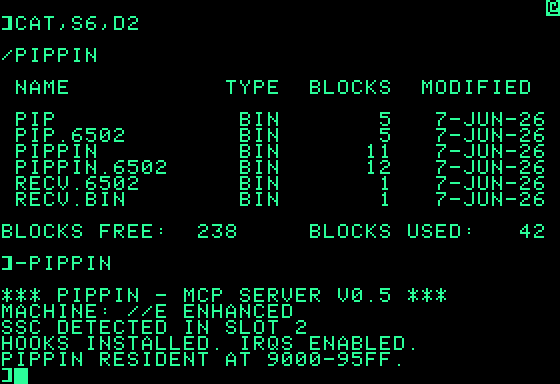

# PIPPIN

A Model Context Protocol server that runs on an Apple II. An MCP client on a modern machine speaks JSON-RPC over a serial line to a ProDOS 8 terminate-stay-resident program on the Apple, which reads and writes the machine's memory and presses its keys. The host BASIC `]` prompt stays usable the whole time; PIPPIN listens in the background off the Super Serial Card's receive interrupt.  It is a genuine, standalone MCP server on 8-bit hardware, controllable by a modern client.

> A pippin is the seed inside an apple. It is also an apple cultivar, and the
> name of Apple's catastrophically unsuccessful 1995 multimedia console. The
> metaphor fits: a small MCP server living inside an Apple II.

It has been driven end to end against an Apple //c+ over a USB-serial null-modem link, using the official, unmodified Python MCP SDK: an agent developed an Applesoft BASIC program and used the MCP client to type and run it on the //c+ with `send_keystroke`, then read the result back off the text screen with `read_memory`, all over the wire.

## Demo

Claude driving the Apple II over MCP: typing an Applesoft program in at the `]`
prompt with `send_keystroke`, running it, and reading the screen back with
`read_memory`.

https://github.com/user-attachments/assets/74f2e337-c4d4-4d04-8787-8cc8c3f5d797

## Contents

- [Demo](#demo)
- [How it works](#how-it-works)
- [Requirements](#requirements)
- [Driving it](#driving-it)
- [Running it](#running-it)
- [MCP tools](#mcp-tools)
- [Gotchas and configuration](#gotchas-and-configuration)
- [Build from source](#build-from-source)
- [Host tools](#host-tools)
- [Future enhancements](#future-enhancements)
- [Colophon](#colophon)
- [License](#license)

## How it works
PIPPIN aims to implement an MCP compliant server over a serial line (SSC, Slot 2, 9600 8N1
by default). Currently two servers are implemented: 
- PIPPIN: A full MCP server running on the Apple II. All processing happens on the Apple.
- PIP: A server leveraged by an MCP front-end which offloads the MCP logic from the Apple.

### PIPPIN

PIPPIN is a full MCP server on the Apple itself. The client speaks
newline-delimited JSON-RPC straight down the wire; the Apple parses each request,
runs the tool, and serializes a JSON-RPC reply. This should provide a full MCP server to an MCP client.

```
 MCP client  ──── JSON-RPC over serial ────>  Apple II (PIPPIN)
 (SDK, etc.)  <─── JSON-RPC over serial ─────  parse → dispatch → run tool → reply
```

The whole JSON/MCP machine (an order-independent JSON object scanner, the
dispatch table, the four tool handlers, and the `tools/list` response) lives in
language-card RAM on the Apple.

The use of the language-card means that PIPPIN will only run on an Apple II with at least 128K of memory. For machines with less than 128K, see PIP below which runs in main memory.

### PIP: a host sidecar does the talking

PIP allows us to split the work of the MCP server. A small Python sidecar on the client is the MCP server the client connects to; it answers `initialize`, `tools/list`, and the
rest by itself. Only tool calls send traffic across the wire, as short fixed-length
binary frames. The PIP reads a one-byte opcode, runs the tool on
raw little-endian arguments, and sends raw bytes back, with no JSON or text
conversion.

```
 MCP client ── MCP ──> Python sidecar ── binary over serial ──> Apple II (PIP)
            <─ MCP ───                <─ binary over serial ───  opcode → run tool → reply
```

That makes the resident handler about 3.7x smaller and the round trips quicker,
at the cost of the Apple no longer being a standalone server: it leans on the
sidecar to be the conformant MCP endpoint. Use PIPPIN when you want the
Apple to be the server; use PIP when you want the smallest, fastest tool
executor.

PIP is basically a generic remote control engine that currently has a Python front-end exposing the engine via MCP.

### Keyboard hook

Both builds run in the background while you keep using the `]` prompt, and both
do it the same way: the Super Serial Card raises an interrupt on every received
byte and PIPPIN/PIP does all of its work inside that interrupt.  Normally we would not want to use the interrupt handler hot path to do processing, but,  both ProDOS and the standard hardware of the non-GS Apple II forces this: the standard 8-bit Apple II has no independent clock or timer to generate interrupts. I wanted PIPPIN to work in this environment. 

At an idle prompt the ROM keyboard read is a single blocking poll, so there is no recurring foreground moment to hand work to. The receive interrupt is the only thing that ticks. When the end of a request frame arrives, the handler does not just buffer the byte and return; it parses, dispatches, runs the tool, and transmits the whole reply before returning.
```
 byte arrives → SSC receive interrupt → store in ring buffer
                                        │
                  frame complete? ──────┤ no → return, wait for the next byte
                                        │ yes
                                        └─→ parse → run tool → send reply → return
```

The trade-off: while it sends a reply (roughly 25 to 50 ms on a 1 MHz machine)
interrupts are off and the foreground is frozen, so you see a brief pause at the
prompt. That suits the turn-taking pace of LLM tool calls, where the client waits
for each reply before sending the next request.

The keyboard hook stays in place for one job: when `send_keystroke` queues a key,
the hook feeds it to the foreground the next time it reads the keyboard, so the
model can type at the prompt. A quick future enhancement could be to remove the keyboard hook and let PIPPIN only do memory reads and writes.

### Where it lives in memory

```
 $2000-$2FFF   installer
 $9000-$95FF   resident handler, keyboard hook, transmit path, receive ring
 $D000-$DFFF   JSON parser + tool handlers in the language-card (PIPPIN only)
```

The PIPPIN/PIP loads at `$2000` as transient install code: it detects the machine
and the card, copies the resident image into place, hooks the keyboard, and
registers the interrupt. After that the `$2000` region is free. The resident
runtime sits just below BASIC.SYSTEM's HIMEM so the graphics pages stay yours.
The PIPPIN uses language-card bank 2 (which ProDOS leaves free) for
the JSON parser and handlers.  PIP does not use the LC.

While I'm partial to the 65C02, both PIPPIN/PIP have 6502 builds for your enjoyment.

`docs/DESIGN.md` has the full detail: the parser, both wire protocols, the ProDOS
interrupt contract, and the real-hardware fixes (TDRE pacing, claiming every
interrupt, and draining receive during transmit).

## Requirements

PIPPIN/PIP have the following execution requirements:
- ProDOS
- An enhanced //e, //c, //c+, or IIgs in 8-bit mode (an unenhanced //e works with the `.6502` builds)
- 128K for PIPPIN, 64K for PIP
- A Super Serial Card or compatible card
- Slot 2, 9600 Baud, 8N1
- **Interrupts must be enabled**

**NOTE**: Your MCP client **must** wait for each tool call to complete before sending the next request or you **will** overwhelm PIPPIN.

The fastest path to get started is to connect your Apple via serial to your MCP client computer and then leverage a bridge using SOCAT. PIPPIN/PIP may work on an Apple II or Apple II+, but, I have not tested those models.

| Path | What you need |
|---|---|
| Run it in an emulator | An emulator with a TCP-reachable Super Serial Card|
| Run it on real hardware | An //e, //c, //c+, or IIgs in 8-bit mode, a USB-serial null-modem dongle, and `socat` for `serial_bridge.sh` (or the self-contained [tincan](https://github.com/artgreen/tincan) instead). |
| Build from source | [Merlin32](https://brutaldeluxe.fr/products/crossdevtools/merlin/) on your `PATH`, with its Library at `~/merlin32/Library`. |

The four binaries ship prebuilt in the tree, so you only need Merlin32 if you
want to rebuild them.

## Driving it

PIPPIN is a standalone, first-class MCP server native to the Apple II. PIP is a binary protocol remote control engine and requires `tools/pippin_mcp.py` as a standard stdio MCP server front-end. Point any MCP client at PIPPIN or PIP's front-end (Claude Desktop, the MCP Inspector, the SDK) and you get the four tools below. 

When PIPPIN/PIP is active, a NULL byte is written to upper right TEXT cell as a signal that it is running. It hasn't ruined anything yet but if it's a problem, I'll likely remove it.

Your cursor will also change or, in some cases, disappear. This is a side-effect of hooking into the ProDOS keyboard hooks - can't do anything about that as annoying as it is.

## Running it

Quick 'n dirty overview:

1. Cable up the real Apple (Slot 2, 9600, 8, N, 1 and **INTERRUPTS ENABLED**).
2. Start the TCP-to-serial bridge on the client computer:

   ```sh
   tools/serial_bridge.sh           # bridge the USB-serial dongle to TCP :1977
   ```
3. Copy PIPPIN/PIP to the real or emulated Apple. A sample disk image is in
   `disk/`, or send one with `RECV.BIN` and `tools/serial_send.py`.
4. `BRUN PIPPIN` (or `PIP`); you should see a welcome banner:

   
5. If using PIPPIN, point your MCP client at your TCP listener and implement
   those plans for world domination you've been putting off. Just remember who helped you get there.
6. If using PIP, stand up the MCP front-end:

   ```sh
   uv run --with mcp python tools/pippin_mcp.py   # point your client at it
   ```

For every way to get there — real Apple II hardware or an emulator's
TCP-bridged Super Serial Card — see [Running PIPPIN and PIP](docs/RUNNING.md).

## MCP tools

Tool names are single characters and argument keys single letters (server-chosen
names are legal MCP), which keeps frames short and the on-Apple parser cheap.

| Tool | Name | Arguments | Does |
|---|---|---|---|
| status | `s` | none | Returns `PIPPIN <ver> m=<mach> wr=<hex> rd=<hex> pw=<n>`. `<mach>` is the detected machine code; the PIP front-end also decodes it to a name (e.g. `m=5 (unenhanced //e)`). |
| read_memory | `r` | `a` (addr, decimal), `l` (len 1-255) | Returns the bytes as hex. Refuses any range touching `$C000-$CFFF`. |
| write_memory | `w` | `a` (addr), `v` (lowercase hex; up to 64 bytes per write on PIPPIN, 128 on PIP) | Writes bytes. Same I/O guard, and also refuses `$BF00-$BFFF`. |
| send_keystroke | `k` | `k` (keycode, decimal) | Queues one key; the keyboard hook injects it on the next foreground read. |

### A round trip on the wire

Poke four bytes into the Apple's memory and read them back. From an MCP client
that is two calls: `call_tool("w", {"a": 768, "v": "deadbeef"})` then
`call_tool("r", {"a": 768, "l": 4})`. On PIPPIN, what crosses the
serial line is plain newline-framed JSON-RPC — parsed, run, and answered on the
Apple itself, nothing translating on the host:

```jsonc
// host → Apple   write DE AD BE EF at $0300 (768)
{"jsonrpc":"2.0","id":3,"method":"tools/call","params":{"name":"w","arguments":{"a":768,"v":"deadbeef"}}}
// Apple → host   write ok
{"jsonrpc":"2.0","id":3,"result":{"content":[{"type":"text","text":"OK"}],"isError":false}}

// host → Apple   read 4 bytes back from $0300
{"jsonrpc":"2.0","id":4,"method":"tools/call","params":{"name":"r","arguments":{"a":768,"l":4}}}
// Apple → host   the bytes, as hex
{"jsonrpc":"2.0","id":4,"result":{"content":[{"type":"text","text":"deadbeef"}],"isError":false}}
```

[`tools/pippin_check.py`](tools/pippin_check.py) runs exactly this exchange end
to end (status, read, write, read-back, and a rejected `$C000` I/O-page read)
against a live machine.

The memory guards are not optional. Reads or writes overlapping the
`$C000-$CFFF` soft-switch page are rejected (`ST=03`), and writes also reject the
`$BF00-$BFFF` ProDOS global page. Poking soft switches blind over a serial link
is a reliable way to hang the machine: on this you can trust me, so PIPPIN does not let you.

## Gotchas and configuration

- One request in flight. PIPPIN dispatches and transmits its whole reply
  inside the interrupt with interrupts off, so it is briefly deaf while
  answering. Send one request, wait for the complete newline-terminated reply,
  then send the next. It drains RX during its own transmit, so a slightly eager
  client survives, but the contract is request, then reply.
- No clean tear-down. There is no interrupt deallocation or keyboard-hook
  restore on exit. A feature for another time, perhaps.
- Slot 2 only. The 6551 register addresses (`$C0A8-$C0AB`) and the firmware
  probe are baked in. No slot scan yet.
- Baud rate: 9600 by default, any rate the 6551 supports. To run at a different
  speed when loaded in memory, see [Changing the baud rate](docs/BAUD.md).
- Real 6551s flag TDRE early. The genuine 6551, and the 65C51 in the //c+,
  report the transmit register empty before the byte has finished clocking out.
  PIPPIN paces a character-time between bytes. Some emulators model this
  correctly and hide the bug, which is exactly the trap if you only test on an emulator.


## Build from source

The binaries ship prebuilt in the tree, so this is only needed to rebuild them.
With [Merlin32](https://brutaldeluxe.fr/products/crossdevtools/merlin/) and `uv`
on hand (see [Requirements](#requirements)), `make` builds `PIPPIN`.

See [Building PIPPIN and PIP](docs/BUILDING.md) for the full `make` target list,
the three-pass build, and how one set of sources targets both CPUs.

## Host tools

Host-side scripts in `tools/`. The Python ones run under
[uv](https://docs.astral.sh/uv/) (add `--with mcp` for the ones that speak MCP);
`serial_bridge.sh` needs `socat`.

| Path | What it does |
|---|---|
| `tools/pippin_mcp.py`, `tools/pippin_protocol.py` | PIP's MCP front-end and its binary codec. |
| `tools/pippin_check.py` | End-to-end JSON-RPC check of a live PIPPIN: status, read, write, read-back, and a rejected `$C000` I/O-page read. |
| `tools/pip_check.py` | The same end-to-end check for PIP, driven with the official MCP SDK through the front-end. |
| `tools/pippin_bridge.py` | Raw stdin<->TCP passthrough so the MCP SDK's stdio client can drive the on-device PIPPIN build directly. |
| `tools/fast_hwtest.py` | One-shot hardware acceptance test of PIP's binary protocol (happy path, adversarial frames, latency). |
| `tools/bench_pip.py` | Round-trip latency benchmark: PIP's binary protocol vs PIPPIN's JSON. |
| `tools/serial_send.py`, `tools/transport.py` | The file sender and its serial / TCP transports. |
| `tools/serial_bridge.sh` | socat bridge between TCP `:1977` and a USB-serial dongle, for driving real hardware. |
| `tools/check_6502.py` | The opcode-scanner gate: fails the build if any 6502 listing emitted a 65C02 opcode (`make scan`). |
| `tools/test_*.py` | pytest suites, including the py65 simulator test of the assembled handler and the 6502-vs-65C02 differential. |

## Future enhancements

Ideas for later, not yet built:

- Create an enhanced version of PIP that uses the LC card and offers additional remote control tools.
- Clean tear-down: Deallocate the interrupt and restore the keyboard hook on
  exit, so booting another SYS file no longer leaves an orphaned handler that
  halts the machine on the next stray RX byte. (Fun!)
- Slot scan: The 6551 register addresses (`$C0A8-$C0AB`) and the firmware probe are baked to slot 2 today; use PASCAL black magic to detect the Super Serial Card in whatever slot it occupies instead.
- No keyboard mode: Drop the keyboard hook and serve only `read_memory` and `write_memory` when keystroke injection isn't needed.

## Colophon

PIPPIN is the capstone of a set of agentic coding skills for the 65xx and the
Apple II. Those skills were refined across many earlier test projects that curated and
indexed the hardware and assembly knowledge a coding agent needs and formatted
it for the agent to use. Using only those skills, an agent implemented a full, standalone MCP server on
8-bit hardware, writing, assembling, simulating, and reviewing the 65C02.
Version 0.5 is the fifth iteration and the first that worked.

## License

MIT. See [LICENSE](LICENSE).
